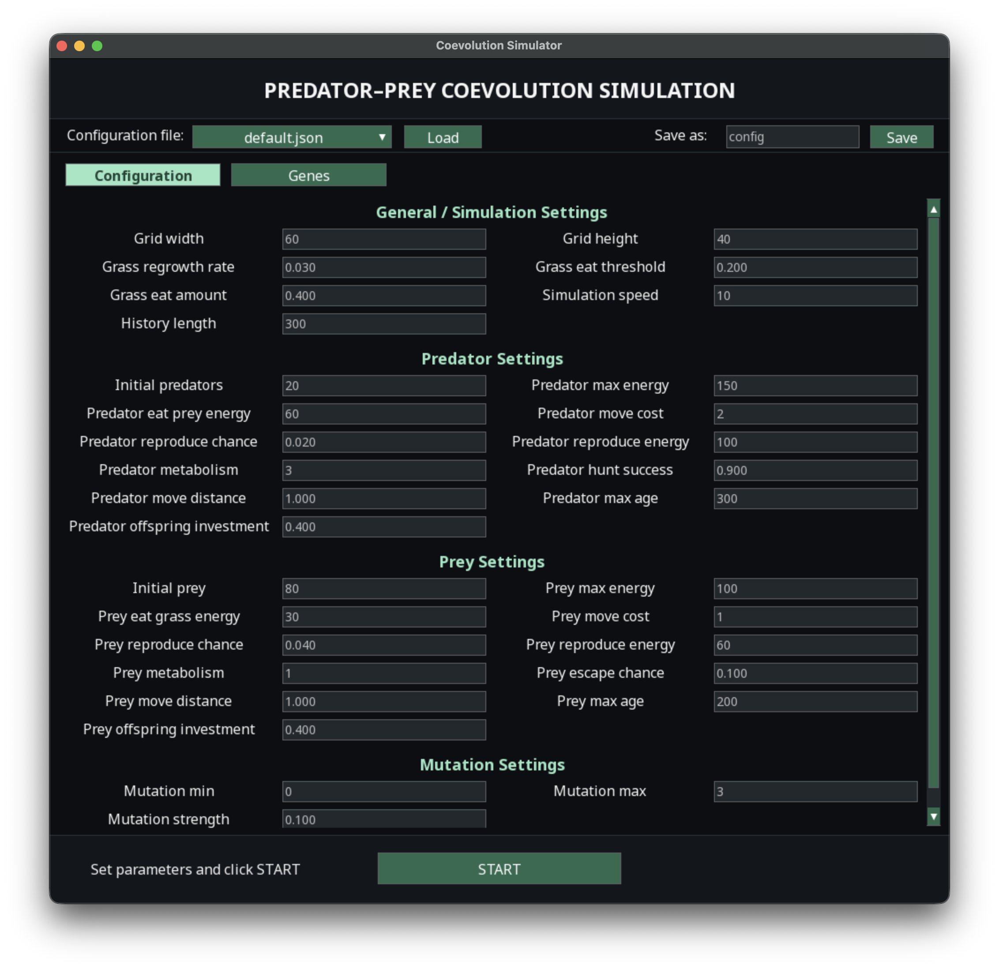
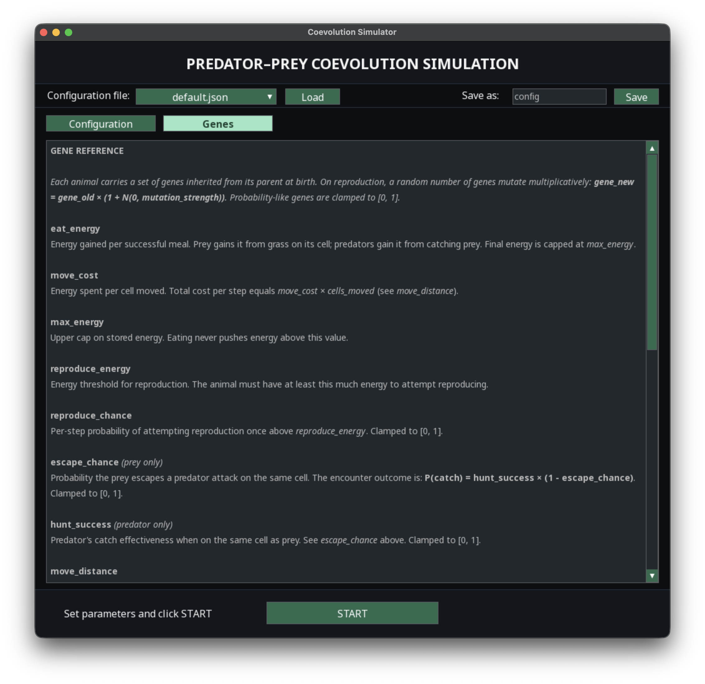
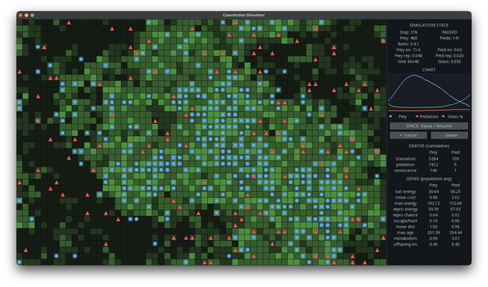

# Predator-Prey Coevolution Simulation

## Author - Przemysław Popowski

A small program that simulates a tiny ecosystem with three things in it: 
- **grass**
- **prey** (*animals that eat grass)*
- **predators** *(animals that hunt prey)*

Everything the animals do costs energy, so they have to keep finding food to stay alive.

Each animal also carries a set of "genes" (its traits, like how fast it moves or how often it reproduces). When an animal has a baby, the baby inherits the parent's genes with small random changes. 

Over many generations this lets the two species slowly adapt to each other, with no behaviour being programmed in advance. You can watch the populations rise and fall, go extinct, or settle into a balance, and you can change the rules of the world before each run.

## How to run it

You need [uv](https://docs.astral.sh/uv/) installed. If you don't have it yet, follow the instructions on their website. 

Once you have uv, open a terminal in the project folder and install the dependencies:

    uv sync

This creates a virtual environment and installs everything the project needs (Python, pygame, pygame-gui). You only need to do this once.

Then start the simulation:

    uv run simulation.py

A window opens with a setup screen where you can tweak the parameters before starting. 

When you're happy with the settings, click **START**. 

Press **Escape** at any time to return to the setup screen.

## The setup screen

The setup screen has two tabs at the top:

- **Configuration** - all the numbers you can change before a run.
- **Genes** - a plain-language explanation of every gene and what it does. Read this tab if you want to understand what mutations can change in animals' behaviour, and how that affects the ecosystem.



*The Configuration tab*



*The Genes tab*

At the top you can load a previously saved set of values from the dropdown
**(click Load)**, or save your current values under a name **(type a name in "Save as" and click Save)**. Saved files are kept in `configs/parameters` as **.json** files.

You can resize the window freely. If it becomes too small to show every parameter at once, the parameter area scrolls *(use the mouse wheel or the scrollbar)* and switches to a single column if needed, so all the settings stay reachable.

## Ready-made configurations

The project comes with a few prepared configurations so you can try something interesting straight away without setting parameters by hand. Pick one from the
dropdown on the setup screen and click **Load**, then **START**. 

Each one is just a saved set of parameters, so you can load it, tweak a value or two, and save it under a new name.

- **default** - the balanced starting point. Grass, prey and predators settle into ongoing boom-and-bust cycles where both species survive together. *Use this as your reference before changing anything.*
- **abundant_meadow** - grass grows back quickly, so there is plenty of food. The prey population gets large and the swings are big. *Good for seeing a lively, crowded ecosystem.*
- **harsh_drought** - grass grows back slowly and prey burn energy faster, so food is scarce. The whole ecosystem stays small and comparatively calm. *Good for seeing survival under pressure.*
- **fragile_predators** - predators are very good hunters, are more numerous at the start, and the prey are almost defenceless. This usually backfires (the predators wipe out their own food supply and then starve to extinction, after which the prey multiply unchecked). *Good for seeing an extinction event and why being too effective as a hunter can be self-defeating.*
- **fast_evolution** - the mutation rate is turned up, so genes change much faster between generations. Traits like reproduction speed evolve quickly and the population can grow very large. *This scenario can get heavy once there are thousands of animals, so expect it to run slower.*

## Parameters

The parameters are split into four groups.

### General settings:

- **Grid width / Grid height** - the size of the world, in cells.
- **Grass regrowth rate** - how much grass grows back in every cell each step. *Higher means more food for prey.*
- **Grass eat threshold** - how much grass a cell must have before prey can eat from it. *Below this level the cell is treated as empty.*
- **Grass eat amount** - how much grass is removed from a cell when prey eats from it.
- **Simulation speed** - how many steps run per second at the start *(you can change this live with the + and - keys).*
- **History length** - how many recent steps the population chart keeps on screen.

### Predator settings and Prey settings (most options exist for both species):

- **Initial predators / Initial prey** - how many animals exist at the start.
- **Max energy** - the most energy an animal can store.
- **Eat prey energy / Eat grass energy** - energy gained from one successful meal.
- **Move cost** - energy spent per cell moved.
- **Reproduce chance** - the chance per step of trying to have a baby *(once the animal has enough energy).*
- **Reproduce energy** - how much energy an animal needs before it can reproduce.
- **Metabolism** - energy burned every step just by being alive. *Higher means the animal starves faster.*
- **Hunt success (predators)** - how good a predator is at catching prey.
- **Escape chance (prey)** - how likely prey is to escape an attack.
- **Move distance** - how many cells an animal moves per step.
- **Max age** - once an animal lives past this age it starts to age: each step it has a small chance of dying of old age, and that chance keeps rising the older it gets. *Below this age there is no aging.*
- **Offspring investment** - the fraction of its own energy a parent gives to each baby. *High means few strong babies, low means many weak ones.*

### Mutation settings:

- **Mutation min / Mutation max** - when a baby is born, a random number of its genes *(between these two values)* change slightly.
- **Mutation strength** - how big those random changes are. *0.1 means a typical change is about ten percent up or down.*

A good way to experiment is to change one parameter at a time and watch how the ecosystem reacts. *For example, lower the grass regrowth rate and see whether the prey can still survive.*

## How to read the results



*The running simulation*

The simulation window has the world on the left and an information panel on the right.

In the world, prey are drawn as blue circles and predators as red triangles. 

The background colour of each cell shows how much grass is there *(light green means there is little, dark green means there is a lot).*

Click on any animal to select it - a highlight ring appears around it and the panel shows that exact
animal's genes instead of the population average.

The panel on the right shows, from top to bottom:

- **Simulation state** - current step number, how many prey and predators are alive, their ratio, their average energy, and basic world settings.
- **Chart** - a live line graph of prey (blue), predators (red) and grass percentage (green) over the recent steps. *This is the easiest way to spot boom-and-bust cycles or a crash.*
- **Deaths (cumulative)** - a running count of how many animals of each species died, split by cause: starvation, predation (being eaten) and senescence (old age).
- **Genes** - the average gene values across the living population, or the genes of the animal you clicked. *Watching these change over time shows evolution in action.*

Controls during a run:

- **Space** - pause or resume.
- **Plus and minus keys** (or the on-screen buttons) - speed up or slow down.
- **R** - restart the run with the same settings.
- **Escape** - return to the setup screen.
- **Mouse wheel over the panel** - scroll the panel if it does not fully fit.

If every animal dies, the simulation pauses automatically.

## Project structure

```
.
├── configs/                        # everything the program reads
│   ├── colors.py                   # colours used for drawing
│   ├── styles.json                 # fonts and colours for GUI
│   ├── layout.json                 # sizes and spacing of GUI
│   ├── param_groups.json           # how parameters are grouped
│   ├── genes_info.json             # text shown on the Genes tab
│   └── parameters/                 # saved configs
│       ├── default.json            # balanced starting point
│       ├── abundant_meadow.json    # resource-rich world
│       ├── harsh_drought.json      # resource-poor world
│       ├── fragile_predators.json  # predators overhunt and die out
│       └── fast_evolution.json     # high mutation, fast gene drift
├── report/                         # project report
│   ├── coevolution_simulation.pdf  # compiled PDF report
│   ├── coevolution_simulation.tex  # LaTeX source
│   ├── projectreport.cls           # LaTeX class file
│   ├── bibliography.bib            # references
│   └── figures/                    # figures used in the report
├── screenshots/                    # screenshots used in this README
├── config_screen.py                # the setup screen shown before a run
├── README.md                       # this file
├── simulation.py                   # main program: engine + simulation
├── pyproject.toml / uv.lock        # dependencies, managed by uv
└── .gitignore                      # files to ignore in git
```
